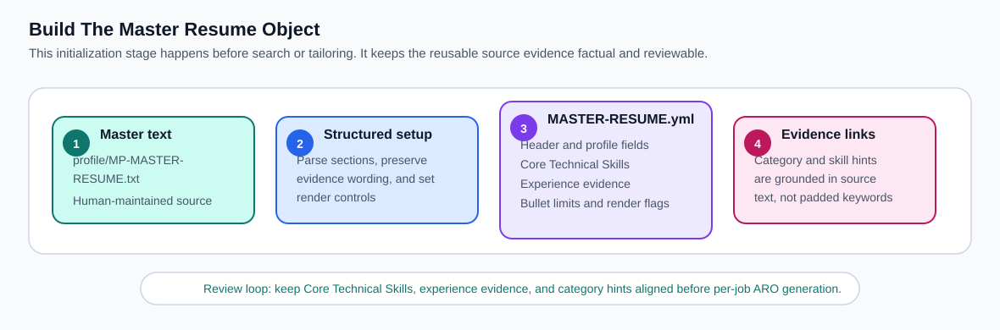
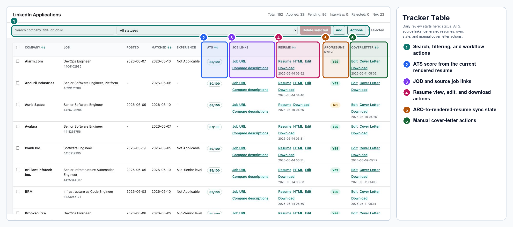
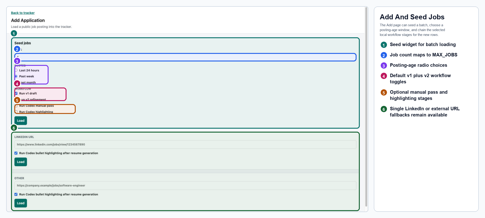
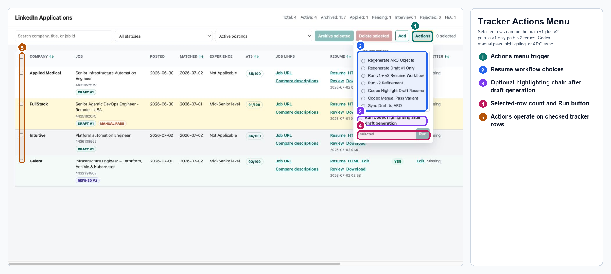
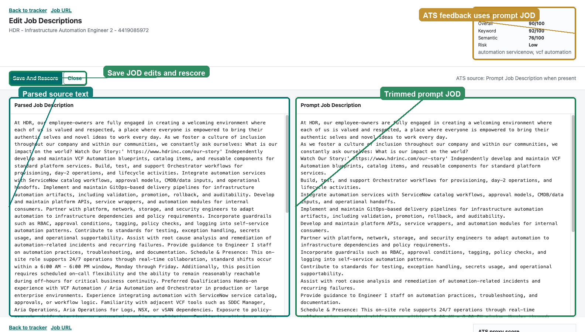
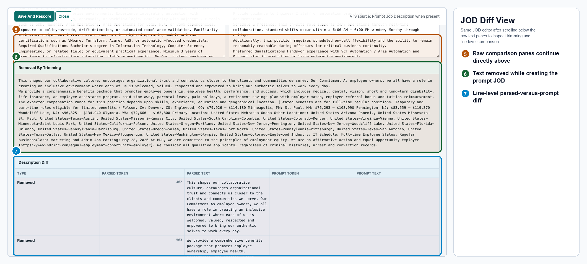
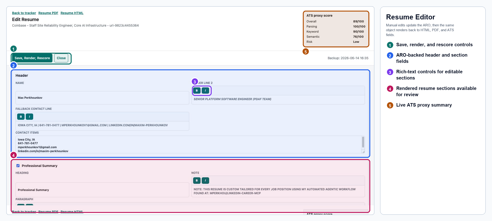
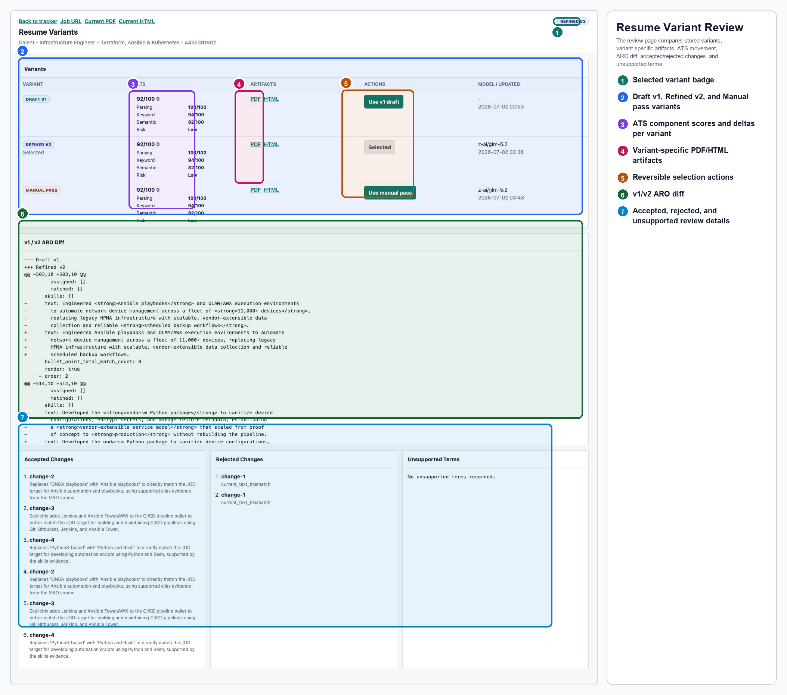
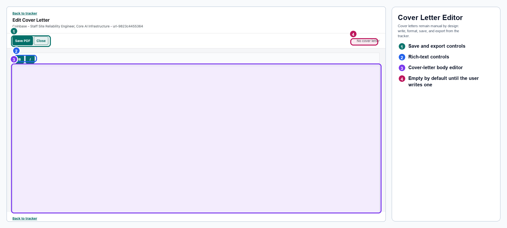
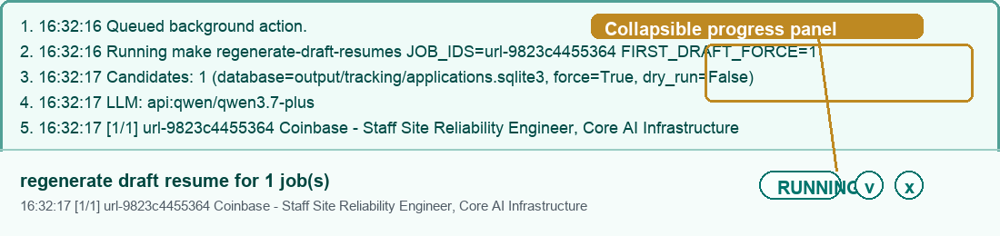

# LinkedIn Career MCP

LinkedIn Career MCP is a local, database-backed job-search and resume-tailoring workflow. It searches public LinkedIn postings, trims noisy job-opening descriptions, builds per-job Application Resume Objects (AROs) from a structured master resume, renders versioned resume HTML/PDF variants, and keeps the human review loop in a Flask tracker.

The project is intentionally local-first. It does not authenticate to LinkedIn, read private member data, submit applications, or auto-generate cover letters.

## What Changed

The workflow now centers on explicit objects instead of large freeform context bundles. `profile/MASTER-RESUME.yml` is the canonical Master Resume Object (MRO); each job gets an Application Resume Object (ARO) deep-copied from that master; cover letters are manual Cover Letter Objects (CLOs); and the Flask database stores the ARO, rendered HTML, rendered PDF, ATS fields, resume variants, and user edits.

That object-oriented design is more straightforward than the previous artifact pipeline: each step has a clear input and output, the master resume carries structured source evidence, and expensive LLM calls are limited to the parts that need semantic matching. The result is easier to modify, easier to debug, and more reproducible across runs.

The v3.0.0 redesign is documented in the [release notes](docs/release-notes/3.0.0.md), [experiment log](docs/experiments/2026-06-21-jod-target-aro-redesign.md), and [architecture decision record](docs/adr/0001-adopt-jod-target-aro-rewrite-workflow.md). The guiding lesson was to keep source evidence bounded and truthful, then let the LLM generate role-specific bullets instead of asking local scoring code to pick from a fixed bullet inventory. The Codex post-generation highlighting workflow is documented in [ADR 0002](docs/adr/0002-codex-resume-highlighting-workflow.md), and the DB-backed second-pass variant workflow is documented in the [4.0.0 release notes](docs/release-notes/4.0.0.md).

## Terms

- **JOD**: Job Opening Description. This is the parsed posting text after trimming low-signal boilerplate such as benefits, compensation, legal notices, and generic company copy.
- **MRO**: Master Resume Object. This is the canonical `MASTER-RESUME.yml` resume source with neutral render flags, skill categories, and experience evidence linkages.
- **ARO**: Application Resume Object. This is a per-job deep copy of the MRO with JOD match lists, generated experience bullets, render flags, and manual edits.
- **CLO**: Cover Letter Object. This is a manually pasted/edited rich-text cover letter stored in the database and rendered to PDF.
- **ATS score**: A local proxy score that combines parsing, keyword, semantic, and formatting signals from the rendered resume and the selected JOD.
- **ATS diagnostics**: Explainable ATS details stored with generated variants, including matched terms, unmatched weighted terms, noisy phrase matches, component scores, and semantic signals.
- **Resume variant**: A DB-backed resume version for a job. `v1` is the first draft, `v2` is the GLM second-pass refinement, and `manual` is a Codex manual pass. Selecting a variant only changes the active HTML/PDF links and is reversible.

## Master Resume Setup

The master resume build is a separate initialization workflow. It happens before LinkedIn search and before per-job tailoring.



The source text in `profile/MP-MASTER-RESUME.txt` is converted into `profile/MASTER-RESUME.yml` with Codex skills and project guidelines. The important part is the linkage work: professional-experience source evidence is mapped to Core Technical Skills categories and terms, using both direct skill matches and broader category matches. The current role stores paragraph-level source evidence in the MRO so per-job ARO generation can tailor final bullets without reading a separate `tmp/master-paragraphs.md` file.

## Application Workflow

Once the master resume exists, the default operator path is to seed rows, run
v1 plus v2 resume generation, review the variants in the tracker, and choose
which resume should power the normal HTML/PDF links. Manual pass and Codex
highlighting are extra review or polish stages, not prerequisites for the
default v1 plus v2 path.


1. Plan optimized LinkedIn search terms from the master resume.
2. Search public LinkedIn postings and fetch job details.
3. Parse and trim each JOD with the multi-pass ML cleaner.
4. Seed the Flask SQLite database with raw JOD and prompt JOD.
5. Deep-copy the MRO into an ARO for the job.
6. Ask the configured LLM through OpenRouter to match Core Technical Skills to the JOD.
7. Ask the JOD-target model to distill the JOD into compact requirement targets.
8. Rewrite the rendered experience jobs from their ARO source evidence, including current-role paragraph evidence stored in the MRO.
9. Store the first draft as `v1` in SQLite, render resume HTML through Jinja2, render PDF, and calculate ATS score.
10. Run the GLM 5.2 second-pass refinement as the default resume-generation follow-up, storing a `v2` variant with critique, ATS diagnostics, accepted/rejected patches, validation details, and model metadata.
11. Optionally run the Codex manual pass workflow to store a `manual` variant that reviews v1, v2, critique output, validation output, JOD text, and master-resume evidence.
12. Optionally run the guarded Codex highlighting workflow to add selective `<strong>` emphasis to professional-experience bullets without changing the underlying wording.
13. Review variants, select the active draft, edit, download, and rescore from the Flask UI.

The default `make regenerate-resumes` target creates or refreshes both `v1` and
`v2`; `make regenerate-draft-resumes` is the explicit v1-only path. User edits
update the ARO as the workflow basis. The selected resume variant controls the
normal HTML/PDF links on the tracker, and switching between v1, v2, and manual
variants copies that variant into the active resume fields without deleting the
other variants.

### JOD Target Rewrite Example

The draft generator reads the tracker row, preferring `prompt_job_description` and
falling back to `job_description`, then writes the generated ARO and rendered artifacts
back to the same row. In code, the candidate read is effectively:

```sql
SELECT job_id, company, job_title, prompt_job_description, job_description,
       application_resume_object
FROM applications
ORDER BY rowid;
```

The stored first draft updates fields such as `application_resume_object`,
`resume_html_content`, `resume_content`, `resume_filename`, `source_resume_path`,
`ats_score`, `ats_keyword_score`, and `ats_semantic_score`, and it is also
backfilled into `application_resume_variants` as `variant_key = 'v1'`. The
`source_*_path` fields are populated for explicit artifact-cache runs; normal
Flask/Make runs can store the rendered HTML/PDF blobs in SQLite with blank
source paths.

A cached smoke run for `url-9823c4455364` used this row:

```text
company: Coinbase
job_title: Staff Site Reliability Engineer, Core AI Infrastructure
prompt_job_description: 3342 chars
cache: tmp/final_jod_workflow_smoke_20260621T043327Z/artifacts
ATS after generation: 90 overall, 90 keyword, 77 semantic
```

The first GLM 5.2 call turns the trimmed JOD into compact targets. The complete
cached response is in `url-9823c4455364_jod_targets_response.json`:

```json
{
  "job_opening_description": {
    "requirements_targets": [
      "8+ years of experience automating and supporting AWS cloud infrastructure and network environments.",
      "Hands-on experience with infrastructure-as-code tools such as Terraform, Ansible, Chef, Puppet, or Salt.",
      "Production experience deploying, managing, and troubleshooting containerized workloads using Docker and Kubernetes.",
      "Proficiency in scripting or programming with Python, Bash, Ruby, or Go, including developing full-stack internal applications.",
      "Experience with Git-based CI/CD pipelines, including extending frameworks for IT services and enterprise network platforms.",
      "Track record of leading incident response under strict SLAs, including on-call support, root cause analysis, and blameless retrospectives.",
      "Experience building automation and tooling to streamline IT workflows, eliminate manual tasks, and improve deployment velocity.",
      "Experience strengthening observability by defining metrics, implementing monitoring solutions, and managing log aggregation.",
      "Experience partnering with Security and Compliance to integrate surveillance tooling into deployment pipelines.",
      "Experience utilizing generative AI responsibly to drive measurable improvements in workflow efficiency, cost, and quality.",
      "Strong network security fundamentals and experience working in highly regulated, fast-paced, remote-first IT environments.",
      "Expertise with Linux administration and automating EC2 or container deployments with Terraform."
    ]
  }
}
```

The ARO stores that as `job_opening_description.schema_version:
job_opening_description.v1` with ordered `requirements_targets`. The next GLM 5.2
calls rewrite each rendered job from only that job's ARO source evidence. For a
prior-role example, job order `2` used the cached prompt
`url-9823c4455364_job_2_rewrite_prompt.txt`. This prompt excerpt preserves the
full target list and full raw experience block:

```text
Target Job Requirements:
- 8+ years of experience automating and supporting AWS cloud infrastructure and network environments.
- Hands-on experience with infrastructure-as-code tools such as Terraform, Ansible, Chef, Puppet, or Salt.
- Production experience deploying, managing, and troubleshooting containerized workloads using Docker and Kubernetes.
- Proficiency in scripting or programming with Python, Bash, Ruby, or Go, including developing full-stack internal applications.
- Experience with Git-based CI/CD pipelines, including extending frameworks for IT services and enterprise network platforms.
- Track record of leading incident response under strict SLAs, including on-call support, root cause analysis, and blameless retrospectives.
- Experience building automation and tooling to streamline IT workflows, eliminate manual tasks, and improve deployment velocity.
- Experience strengthening observability by defining metrics, implementing monitoring solutions, and managing log aggregation.
- Experience partnering with Security and Compliance to integrate surveillance tooling into deployment pipelines.
- Experience utilizing generative AI responsibly to drive measurable improvements in workflow efficiency, cost, and quality.
- Strong network security fundamentals and experience working in highly regulated, fast-paced, remote-first IT environments.
- Expertise with Linux administration and automating EC2 or container deployments with Terraform.

Raw Experience (University of Iowa Hospitals and Clinics | Iowa City, IA | Engineering Support Specialist | Jan 2020 - May 2021):
- Adhered to strict software development lifecycles to build custom Python and AutoIT automation scripts, streamlining system upgrades across hundreds of mission-critical platform nodes as full-cycle software engineering work.
- Collaborated on the structural design and implementation of a DICOM anonymization server utilizing a modern React.js frontend interface as web application development.
- Conducted performance troubleshooting, defect handling, and remote patch deployments on highly regulated medical platform surfaces through deep debugging and patching.
- Administered IT and HIS systems for the department of radiology, including Philips Vue PACS and interconnected applications/software used by regulated clinical teams as radiology systems administration.
- Provided technical support for HCIS radiology servers and computer systems across mission-critical hospital environments across the support scope.
- Wrote Python and AutoIT scripts for remote software/update deployment and performed mass patch rollouts across hundreds of systems as automation detail.
- Helped implement a DICOM anonymization server over IPv4 with a React.js frontend as DICOM detail.

CRITICAL RULES:
1. Strictly use the exact numerical metrics and outcomes provided in the Raw Experience.
2. Do NOT hallucinate new tools, soft skills, software competencies, or outcomes.
3. Rephrase verbs and phrase structures to align with the Target Job Requirements.
4. If a target cannot be supported by the Raw Experience, ignore that target.
5. Format the final output as between 2 and 5 punchy bullet points utilizing the Google XYZ framework.
6. Output ONLY the raw string of each bullet point, one per line. No introductions, markdown, numbering, or chat text.
```

The cached response replaced that job's source evidence with generated rendered bullets:

```text
Accomplished streamlined system upgrades and eliminated manual IT workflows, as measured by mass patch rollouts across hundreds of mission-critical platform nodes, by writing custom Python and AutoIT automation scripts for remote software and update deployment.
Accomplished the development of full-stack internal applications for highly regulated clinical teams, as measured by the successful implementation of a DICOM anonymization server over IPv4, by collaborating on the structural design and implementation utilizing a modern React.js frontend interface.
Accomplished sustained operational stability in mission-critical hospital environments, as measured by effective performance troubleshooting and defect handling across HCIS radiology servers and computer systems, by administering IT and HIS systems and conducting remote patch deployments on regulated medical platform surfaces.
```

The stored ARO keeps those generated bullets as the rendered experience content
for that role. The current-role rewrite follows the same source-evidence pattern,
but starts from paragraph-level evidence stored directly in `profile/MASTER-RESUME.yml`.

### Second-Pass Variant Workflow

Second-pass refinement is DB-backed and part of the normal resume-generation
path. `make regenerate-resumes` runs v1 draft generation first, then GLM 5.2
refinement; the standalone `make refine-draft-resumes` target exists for
creating or rerunning v2 when v1 already exists. The
`application_resume_variants` table
stores each variant's ARO YAML, rendered HTML, PDF bytes, ATS scores, ATS
diagnostics, evidence packet, critique prompt/response, parsed critique,
accepted/rejected validation report, external critique classification, and model
metadata.

Think of v2 as a critique-and-validation pass, not a free rewrite. The critique
prompt gives GLM 5.2 the job identity, the current v1 ARO, compact JOD targets,
MRO source evidence, rendered ARO source evidence, ATS diagnostics, and optional
external critique suggestions that were already classified as `supported`. The
prompt asks for small recommendations only, and every recommendation must cite
evidence refs from that payload.

GLM returns structured JSON rather than edited resume text. A proposed change
looks like this:

```json
{
  "change_id": "supported-rest-alias",
  "change_type": "rewrite_bullet",
  "target": {
    "section": "professional_experience",
    "field": "text",
    "job_order": "1",
    "bullet_order": "2"
  },
  "current_text": "Existing bullet text.",
  "proposed_text": "Evidence-backed replacement text.",
  "rationale": "Why this improves role alignment.",
  "evidence_refs": ["mro:job:1:bullet:2", "jod:target:1"],
  "unsupported_claims": []
}
```

The validator decides which recommendations become v2. It accepts a
recommendation only when the evidence refs are known, the target exists in the
ARO, the `current_text` still matches the v1 field, and the proposed text does
not introduce unsupported factual terms. Accepted changes are applied to a deep
copy of v1 and rendered as the `v2` variant.

Rejected recommendations are kept as review metadata but are not applied. For
example, a supported alias such as "REST APIs" can be accepted when the evidence
already contains matching RESTful API work. A recommendation to add "Kubernetes
platform ownership," a certification, a new compliance claim, or a new metric is
rejected unless the MRO/ARO evidence already supports it. ATS missing terms are
review signals, not instructions to embellish the resume.

External critique text can be pasted into the refinement workflow. Suggestions
are classified as `supported`, `needs_user_evidence`, `noisy_or_role_mismatch`,
or `rejected`. Only supported suggestions may feed the patch validator, and the
validator still has the final say.

The second pass stores `v2` and, while a row is still using automatic resume
selection, makes it the active resume ahead of v1. The tracker's variant review
page can compare v1 and v2, download either HTML/PDF, inspect ATS deltas and
accepted/rejected changes, then switch the active resume links with `Use v1
draft` or `Use v2 draft`.

The manual pass is a separate Codex workflow. It receives v1, v2, v2 critique
and validation details, ATS diagnostics, JOD text, prompt JOD text, and
master-resume evidence, then stores a `manual` variant through the same DB model.
Automatic resume selection prefers `manual`, then `v2`, then `v1`; tracker
review actions still allow an explicit override with `Use manual pass`, `Use v2
draft`, or `Use v1 draft`.

## Flask Tracker

The tracker is the daily operating surface. The main page shows job status, ATS score, JOD links, resume links, selected resume variant, ARO/resume sync state, and manual cover-letter actions.



The Add page can seed a batch of public postings and chain the selected stages
for the newly seeded rows. The main Actions menu runs the same workflow family
against selected tracker rows.





The JOD editor keeps the source text and prompt text visible side by side. Saving
this view updates the JOD fields and recalculates ATS values from the current
resume. The second image is the same page scrolled below the raw text panes,
where the tracker shows removed text and a line-level diff.





The resume editor exposes ARO-backed fields and rich-text controls. Saving re-renders HTML/PDF and refreshes ATS scoring.



Each job with generated resumes has a variant review page. The tracker badges the
selected draft as `Draft v1`, `Refined v2`, or `Manual pass`; the review page
shows each variant's ATS score and component deltas, missing terms, accepted and
rejected changes, unsupported claims, ARO diff, and variant-specific HTML/PDF
links. The `Use v1 draft`, `Use v2 draft`, and `Use manual pass` actions are
reversible because they only copy the selected variant into the active resume
fields.



Cover letters are manual for now. The edit page provides a rich-text area for pasted content, then renders the emerald-style PDF on save.



Long-running actions stream into a collapsible progress panel so draft regeneration does not block the tracker UI.



## Commands

Install the local environment:

```bash
make install
```

Launch the Flask tracker:

```bash
make launch-website
```

Seed new LinkedIn rows into the database. The CLI posting-age default is
`DATE_POSTED=past_week`; override it with `past_24_hours`, `past_week`, or
`past_month` when you want a different search window:

```bash
make seed-jobs MAX_JOBS=5 DATE_POSTED=past_week
```

The tracker Add popup also has a seed widget. Set the job count and posting age
window (last 24 hours, past week, or past month), then choose which steps to run
for the newly seeded rows: v1 draft generation, v2 refinement, Codex manual
pass, and Codex highlighting. By default it selects v1 draft generation and v2
refinement, matching the main v1 plus v2 path; manual pass and highlighting are
opt-in.

Generate or regenerate the main resume workflow for stored jobs. This writes
the first draft as `v1`, then runs GLM 5.2 refinement and stores `v2` without
selecting it. Use this as the default resume generation command:

```bash
make regenerate-resumes JOB_IDS="4424184336"
```

Run the same main workflow after seeding new LinkedIn rows:

```bash
make seed-jobs regenerate-resumes MAX_JOBS=5 DATE_POSTED=past_week
```

Generate or regenerate only the first-draft ARO resume for stored jobs:

```bash
make regenerate-draft-resumes JOB_IDS="4424184336"
```

Recreate stored ARO objects from the latest master resume without API calls:

```bash
make regenerate-aro-objects JOB_IDS="4424184336"
```

Render the current stored ARO into resume HTML/PDF and refresh ATS scoring without an LLM call:

```bash
make sync-draft-to-aro JOB_IDS="4424184336"
```

Add selective Codex-driven bolding to existing draft resume bullets:

```bash
make highlight-draft-resumes JOB_IDS="4424184336"
```

Limit the polish pass to one rendered Professional Experience company when a
resume only needs highlighting in that role:

```bash
make highlight-draft-resumes JOB_IDS="4424184336" HIGHLIGHT_EXPERIENCE_COMPANY=Oracle
```

Run only the GLM 5.2 second-pass refinement for one job, or for all active
postings. This can create `v2` for a job that only has v1, or rerun and replace
an existing v2 variant:

```bash
make refine-draft-resumes JOB_IDS="4424184336"
make refine-draft-resumes JOB_IDS=all
```

This stores `v2` resume variants and comparison metadata. Automatic resume
selection prefers v2 over v1 unless the tracker row has an explicit variant
selection.

Run the Codex manual pass for selected jobs after v1 and v2 variants exist:

```bash
make manual-pass-resumes JOB_IDS="4424184336"
```

This stores `manual` resume variants. Automatic resume selection prefers manual
over v2 and v1 unless the tracker row has an explicit variant selection.

Run validation:

```bash
make lint
make test
```

## MCP Tools

The server executable is created at `.venv/bin/linkedin-career-mcp`.

```json
{
  "mcpServers": {
    "linkedin-career": {
      "command": "/Users/mperkhou/dev/codex/linkedin-career-mcp/.venv/bin/linkedin-career-mcp"
    }
  }
}
```

Available MCP capabilities include public LinkedIn search, public job-detail retrieval, raw payload inspection, and the database-seeding matching workflow. The matching workflow no longer creates file-system resume or cover-letter artifacts; it seeds application/JOD rows for later ARO generation.

## Configuration

The default LLM provider is the API/OpenRouter path:

- `LINKEDIN_CAREER_MCP_LLM_PROVIDER`: `api` or `ollama`
- `LINKEDIN_CAREER_MCP_LLM_API_KEY`: API key for OpenRouter-compatible calls
- `LINKEDIN_CAREER_MCP_LLM_API_MODEL`: default API model for non-draft-generation API calls
- `LINKEDIN_CAREER_MCP_LLM_PLANNER_API_MODEL`: cheaper planner model for search-query generation
- `LINKEDIN_CAREER_MCP_OLLAMA_MODEL`: local fallback model when provider is `ollama`

Draft generation uses the JOD-target rewrite framework by default. Core Technical
Skills matching, JOD target generation, and experience-bullet rewrite calls default
to OpenRouter model `z-ai/glm-5.2`; override with:

```bash
JOD_MODEL=<model-id> make regenerate-draft-resumes JOB_IDS="4424184336"
```

Use `CORE_SKILL_MODEL=<model-id>` only when Core Technical Skills matching should
use a different model from the JOD target and bullet rewrite calls.

Use `MASTER_RESUME=<path>` to run the same ARO workflow against
an alternate master resume object without replacing the canonical MRO.

Second-pass refinement defaults to GLM 5.2 through `SECOND_PASS_MODEL` and stores
its output as DB variants:

```bash
SECOND_PASS_MODEL=z-ai/glm-5.2 make refine-draft-resumes JOB_IDS=all
```

Override the second-pass model or timeout when needed:

- `SECOND_PASS_MODEL`: OpenRouter model for v2 critique/refinement, default
  `z-ai/glm-5.2`.
- `SECOND_PASS_TIMEOUT_SECONDS`: per-row LLM timeout for v2 refinement,
  default `300`.

The optional Codex highlighting workflow runs after draft generation. The Codex
CLI returns JSON patches, and Python validates that only `<strong>` tags were
added before writing the ARO and re-rendering HTML/PDF:

```bash
CODEX_MODEL=gpt-5.5 make highlight-draft-resumes JOB_IDS="4424184336"
```

Override the Codex command or per-row timeout when needed:

- `CODEX_COMMAND`: Makefile override for the Codex CLI command.
- `CODEX_MODEL`: Makefile override for the Codex model, default `gpt-5.5`.
- `CODEX_TIMEOUT_SECONDS`: Makefile override for the Codex CLI timeout.
- `MANUAL_PASS_MASTER_RESUME_TEXT`: master-resume source text included in the
  manual pass evidence bundle.
- `HIGHLIGHT_EXPERIENCE_COMPANY`: optional company-name filter for the rendered
  Professional Experience jobs sent to Codex.
- `HIGHLIGHT_EXPERIENCE_JOB_ORDER`: optional ARO job-order filter for the
  rendered Professional Experience jobs sent to Codex.
- `LINKEDIN_CAREER_MCP_CODEX_COMMAND`: script-level Codex command fallback.
- `LINKEDIN_CAREER_MCP_CODEX_MODEL`: script-level model fallback.
- `LINKEDIN_CAREER_MCP_CODEX_TIMEOUT_SECONDS`: script-level timeout fallback.

The important local files are:

- `profile/MP-MASTER-RESUME.txt`
- `profile/MASTER-RESUME.yml`
- `output/tracking/applications.sqlite3`
- `templates/resume/master_resume.html.j2`

## Operational Limits

The workflow depends on public LinkedIn pages and external LLM APIs. LinkedIn
can throttle guest traffic, return `429 Too Many Requests`, or omit job-detail
content. OpenRouter-compatible calls can fail because of provider credits,
timeouts, token limits, or transient empty responses. The Make targets are meant
to be rerun safely, and tracker background actions keep the command output
visible so failures can be inspected before retrying.

The requested job count is a cap, not a guarantee. A seed run may find fewer
usable postings than requested, skip duplicates already in SQLite, or stop a
follow-up stage when an upstream JOD or LLM call fails. The tracker database and
stored variants remain the source of truth for what actually completed.

## Development

The active workflow modules are intentionally smaller than the retired artifact pipeline:

- `src/linkedin_career_mcp/workflows/matching.py`: LinkedIn search planning, filtering, JOD trimming, and DB seeding.
- `src/linkedin_career_mcp/application_resume.py`: ARO initialization, Core Technical Skills matching prompt, JOD target creation, and evidence-backed bullet rewriting.
- `src/linkedin_career_mcp/jod.py`: JOD cleaning and prompt trimming.
- `src/linkedin_career_mcp/resume_refinement.py`: ATS diagnostics, second-pass critique schema, external critique classification, and evidence-backed patch validation.
- `src/linkedin_career_mcp/resume_refinement_cli.py`: DB-backed v2 variant generation and per-job comparison output.
- `src/linkedin_career_mcp/resume_manual_pass.py`: Codex manual pass input bundle, response parsing, validation, and manual variant storage.
- `src/linkedin_career_mcp/resume_highlighting.py`: guarded Codex JSON-patch workflow for selective resume bullet emphasis.
- `src/linkedin_career_mcp/resume_rendering.py`: HTML/PDF rendering.
- `src/linkedin_career_mcp/webapp.py`: database-backed review, edit, download, rescore, and background actions.

Keep the MRO neutral: empty `jod_matched_items`, zero match counts, source-evidence bullets, and no job-specific pruning. Job-specific generated bullets belong in the ARO stored on the application row.

The resume template treats Education, Certifications, and Portfolio as supporting sections
after Professional Experience. By default, they are grouped together so senior-engineer
resumes can use page 1 for high-signal experience and flow supporting sections onto page 2
without a forced break that could create a third page. Set
`resume_layout.supporting_sections_start_on_page_2: true` in an ARO/MRO only when an
explicit page break before supporting sections is desired.
