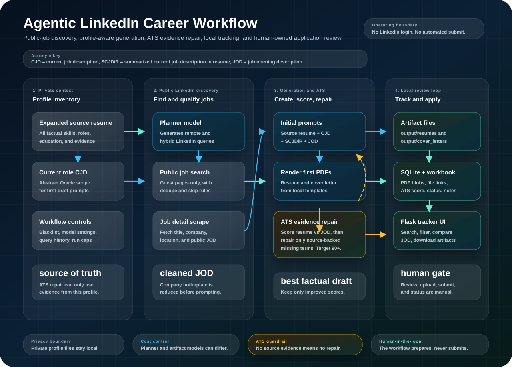
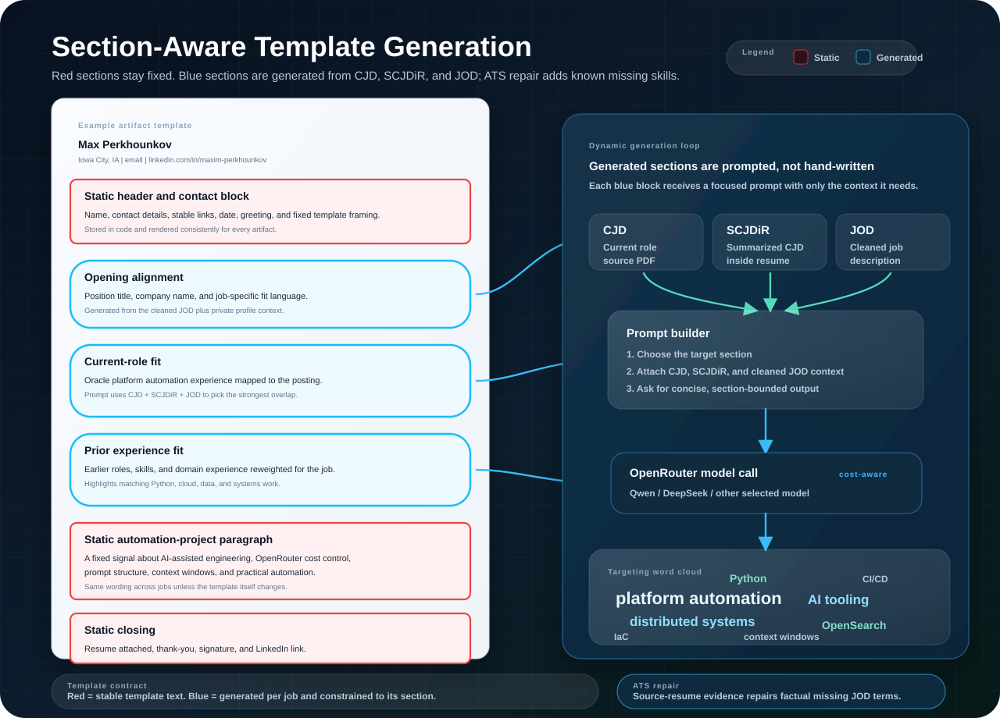
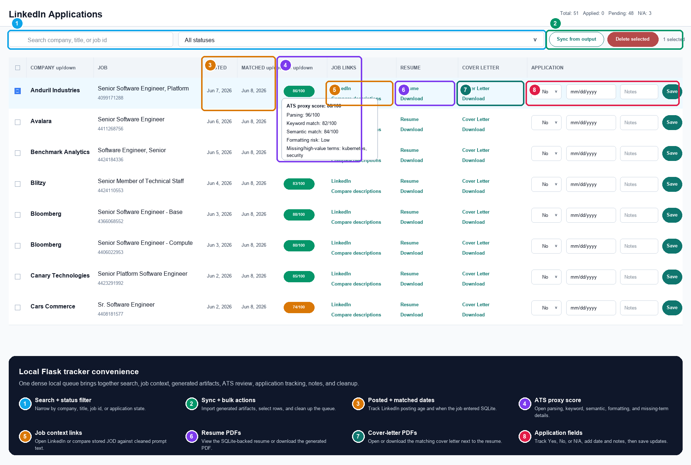

# LinkedIn Career MCP

An agentic job-search and resume-tailoring system built around public LinkedIn job
listings, Model Context Protocol tools, profile-aware LLM workflows, local artifact
generation, and a private SQLite-backed application tracker.

This repo is intentionally more than a scraper. It is a small career operations
platform: it searches public LinkedIn openings, plans profile-specific queries, filters
companies and duplicate jobs, fetches job descriptions, generates tailored resume PDFs,
generates cover-letter PDFs, stores artifacts locally, and presents the application queue
in a fast local web UI.

The resume note points here because the project demonstrates the same engineering habits
I try to bring to production systems: clear boundaries, typed domain models, provider
isolation, testable workflows, practical automation, and human-in-the-loop guardrails.

## Highlights

- **Public LinkedIn job search via MCP**: search and detail tools for public job pages,
  with filters for date, workplace type, job type, seniority, distance, pagination, and
  sort order.
- **Profile-aware search planning**: reads local profile files and asks an LLM to propose
  targeted LinkedIn queries.
- **Tailored resume and cover-letter generation**: renders job-specific PDF resumes from a
  structured local template, then generates cover letters from static template sections plus
  targeted LLM-written opening, Oracle-current-role, and prior-experience fragments. Prompts
  use a cleaned role-focused job description that removes obvious company boilerplate before
  LLM calls.
- **Duplicate-aware workflow**: uses SQLite job IDs to skip openings that already have the
  requested artifact type, and does not count skipped jobs toward the requested run size.
- **Local application tracker**: Flask + SQLite web UI for search/filter, status updates,
  applied dates, notes, DB-backed PDF view/download links, sync from generated output, and
  bulk deletion.
- **Local-first storage**: generated PDFs live under `output/resumes/` and
  `output/cover_letters/`; tracking lives in both `output/tracking/applications.sqlite3`
  and the compatibility workbook at
  `output/tracking/read_applications/linkedin_applications.xlsx`. SQLite rows also keep the
  parsed LinkedIn job description, the cleaned prompt JOD used for generation, the date the
  job was matched into the database, and the LinkedIn posted date when available.
- **Provider-oriented architecture**: LinkedIn public scraping is isolated behind a
  provider boundary, with service and workflow layers kept testable.
- **No LinkedIn credentials required**: the current implementation uses public LinkedIn
  guest pages only. It does not log in, access private member data, or submit applications.

## Workflow Graphic



This system turns public job descriptions and private profile context into reviewable
application artifacts while preserving a human-owned application workflow.

## Section-Aware Templates

Zooming in on the templating layer from the workflow above, this example shows how a
resume or cover-letter artifact is assembled from fixed local sections and targeted
generated sections.



Resume and cover-letter artifacts are assembled from a mix of stable local template sections
and job-specific generated sections. Red sections stay static across jobs; blue sections are
generated through focused prompts that compare the CJD, SCJDiR, and JOD before rendering the
final PDF.

## Local Tracker Convenience

The Flask tracker turns generated artifacts into a practical application queue: search and
filter jobs, open LinkedIn/JOD comparison/resume/cover-letter links, update application
status, keep notes, sync from local output, and clean up selected rows without leaving the
local workflow.



## Current Workflow

```text
profile/* + .blacklist
  -> LLM search planner
  -> MCP/service search layer
  -> LinkedIn public job pages
  -> duplicate/company filters
  -> public job detail fetch
  -> LLM resume and cover-letter generation
  -> ReportLab PDF renderer
  -> output/resumes/*
  -> output/cover_letters/*
  -> output/tracking/applications.sqlite3
  -> local Flask application tracker
```

The workflow is designed to spend requests where they matter. Existing LinkedIn job IDs
are loaded from SQLite before each matching run. If a returned posting already exists, the
workflow skips detail lookup and artifact generation for that job, then keeps searching for
additional fresh openings. The skip key follows the requested mode: resumes for the default
and `resumes-only` runs, cover letters for `cover-letters-only` runs.

LinkedIn's public guest endpoint does not expose a supported "exclude these job IDs"
search parameter, so exclusion is applied inside this project after a public search page
is returned. That still prevents duplicate detail requests and duplicate resume work.

## Local Web UI

Run the tracker locally:

```bash
make launch-website
```

Then open:

```text
http://127.0.0.1:8765
```

The web UI is intentionally dense and work-focused:

- summary counters for total, applied, pending, and N/A applications
- search by company, title, or LinkedIn job ID
- status filter for pending/applied/N/A rows
- direct links to LinkedIn, DB-backed PDF viewers, and DB-backed PDF downloads
- `Posted` and `Matched` columns for LinkedIn posted date and local database match date
- an `ATS` column with a local proxy score and expandable parsing, keyword, semantic, and
  formatting-risk details, plus missing high-value JOD terms
- per-row updates for `applied_to`, `date_applied`, and notes
- automatic cleanup of `~/Downloads/mp_*.pdf` when an application is saved as applied
- "Sync from output" to import workbook/PDF artifacts into SQLite
- checkbox selection plus bulk delete

PDFs are available in two useful forms:

- `/resumes/<job_id>` serves the PDF BLOB stored in SQLite.
- `/resumes/<job_id>/download` downloads the resume PDF BLOB stored in SQLite.
- `/cover-letters/<job_id>` serves the cover-letter PDF BLOB stored in SQLite.
- `/cover-letters/<job_id>/download` downloads the cover-letter PDF BLOB stored in SQLite.
- `/output/resumes/...pdf` serves the generated file from the local output tree.
- `/output/cover_letters/...pdf` serves the generated cover-letter file from the local output
  tree.

Example:

```text
http://127.0.0.1:8765/output/resumes/The_Voleon_Group/4407411418_senior_software_engineer_platform_team/mp_resume_senior_software_engineer_platform_team.pdf
```

## Outputs

Default generated artifacts:

```text
output/
  resumes/
    [company]/
      [job_id]_[job_title]/
        mp_resume_[job_title].pdf
  cover_letters/
    [company]/
      [job_id]_[job_title]/
        mp_cover_letter_[job_title].pdf
  tracking/
    applications.sqlite3
    read_applications/
      linkedin_applications.xlsx
```

The SQLite table uses the LinkedIn job ID as the primary key, so the same opening cannot
appear more than once in the tracker. Bulk deletion removes rows from SQLite and from the
tracking workbook so a later sync does not immediately resurrect deleted entries. Generated
PDF files are left on disk unless you remove them manually.

## Install

```bash
cd linkedin-career-mcp
make install
```

`make install` creates `.venv`, installs the package with development requirements,
installs Ollama if needed, pulls the configured Ollama model, and links the Codex skill at
`~/.codex/skills/linkedin-career-mcp`.

If you only want the Python environment:

```bash
make install-python
```

## LLM Configuration

The matching workflow supports two LLM paths:

- **OpenAI-compatible chat completions API**: default provider. The checked-in default is
  OpenRouter with `deepseek/deepseek-chat`.
- **Local Ollama**: fallback/local option, defaulting to `qwen3:4b`.

For the default API path:

```bash
export LINKEDIN_CAREER_MCP_LLM_API_KEY="..."
make match-jobs
```

For local Ollama:

```bash
export LINKEDIN_CAREER_MCP_LLM_PROVIDER=ollama
make match-jobs
```

## Command-Line Usage

Run the MCP stdio server:

```bash
.venv/bin/linkedin-career-mcp
```

Run the matching workflow:

```bash
make match-jobs
```

By default, `match-jobs` generates both a tailored resume and cover letter for each fresh
job, up to `MAX_JOBS=10`. To cap a run:

```bash
make match-jobs MAX_JOBS=2
```

You can also tune `DATE_POSTED`, `LIMIT_PER_QUERY`, and `MAX_QUERIES` from Make. To
generate only one artifact type:

```bash
make match-jobs ARTIFACT_MODE=resumes-only
make match-jobs ARTIFACT_MODE=cover-letters-only
```

Regenerate artifacts for jobs already stored in SQLite:

```bash
make regenerate-resumes
make regenerate-cover-letters
make regenerate-all
make regenerate-resumes JOB_IDS="4407411418 4342788295"
make regenerate-cover-letters JOB_IDS="4407411418 4342788295"
make regenerate-all JOB_IDS="4407411418 4342788295"
make regenerate-all JOB_IDS="4407411418,4342788295"
```

Regeneration equivalent executable:

```bash
.venv/bin/linkedin-career-regenerate-resumes all
.venv/bin/linkedin-career-regenerate-resumes 4407411418 4342788295
.venv/bin/linkedin-career-regenerate-cover-letters all
.venv/bin/linkedin-career-regenerate-all all
.venv/bin/linkedin-career-regenerate-all 4407411418,4342788295
```

Regeneration reuses `prompt_job_description` or `job_description` from SQLite. It only fetches
LinkedIn details for older rows that do not have either description, waiting two seconds between
those fallback LinkedIn lookups by default. Each regeneration command accepts `all`, one job ID,
space-separated job IDs, or a comma-separated list of job IDs.

Long-running match and regeneration commands print the active job title, company, and job ID to
stderr while they work, then print an artifact audit showing resume and cover-letter coverage.
Cover-letter generation gets one post-run retry by default for jobs still missing a cover letter;
set `COVER_LETTER_RETRIES=0` on the `make` command to disable it.

Matching equivalent executable:

```bash
.venv/bin/linkedin-career-match-jobs \
  --profile-dir profile \
  --blacklist-path .blacklist \
  --output-dir output \
  --date-posted past_week \
  --limit-per-query 10 \
  --max-queries 6 \
  --max-jobs 10
```

Executable artifact modes:

```bash
.venv/bin/linkedin-career-match-jobs
.venv/bin/linkedin-career-match-jobs resumes-only
.venv/bin/linkedin-career-match-jobs cover-letters-only
```

Run the local tracker:

```bash
make launch-website
```

This starts the Flask server and opens the tracker in your browser.
LinkedIn job links route through the local Flask app and try to open in Playwright's
packaged Chromium. If Playwright or its Chromium browser is not installed, the app falls
back to your system default browser.

To enable Playwright Chromium:

```bash
.venv/bin/python -m pip install -e ".[browser]"
.venv/bin/python -m playwright install chromium
```

Restart the local tracker after code changes:

```bash
make restart-website
```

## MCP Client Config

Use the absolute path for your local checkout:

```json
{
  "mcpServers": {
    "linkedin-career": {
      "command": "/Users/mperkhou/dev/codex/linkedin-career-mcp/.venv/bin/linkedin-career-mcp"
    }
  }
}
```

## MCP Tools

### `search_linkedin_jobs`

Search public LinkedIn listings.

Required:

- `keywords`: job title or search terms.
- `location`: city, state, country, or broad target such as `United States`.

Optional:

- `date_posted`: `any_time`, `past_24_hours`, `past_week`, `past_month`
- `job_type`: `full_time`, `part_time`, `contract`, `temporary`, `volunteer`, `internship`, `other`
- `workplace_type`: `on_site`, `remote`, `hybrid`
- `experience_level`: `internship`, `entry_level`, `associate`, `mid_senior`, `director`, `executive`
- `sort_by`: `relevance`, `recent`
- `distance`: miles from the requested location
- `limit`: result count, capped by server settings
- `page`: zero-based page number
- `exclude_job_ids`: LinkedIn job IDs to filter out of returned results

### `get_linkedin_job_details`

Fetch a public LinkedIn job detail page by LinkedIn job ID or public job URL.

### `get_linkedin_job_raw_payload`

Fetch the public LinkedIn guest detail response by LinkedIn job ID or public job URL. This
returns the raw HTML payload, response metadata, and the normalized `parsed` job details
produced from the same payload.

### `find_matching_linkedin_jobs`

Run the end-to-end profile-aware matching workflow:

1. Read supported files from `profile/`.
2. Generate LinkedIn search queries from the profile context.
3. Expand promising searches across remote and hybrid workplace filters.
4. Re-check fetched job metadata and skip explicit on-site search leaks.
5. Filter blacklisted companies.
6. Skip LinkedIn job IDs that already exist in SQLite with requested artifacts.
7. Fetch public details for fresh jobs.
8. Generate and render tailored resume and cover-letter PDFs.
9. Append workbook rows and upsert SQLite tracker records.

The optional `artifact_mode` argument accepts `all`, `resumes-only`, or
`cover-letters-only`; `all` is the default.

## Project Structure

```text
src/linkedin_career_mcp/
  api_client.py              OpenAI-compatible LLM client
  config.py                  environment-driven settings
  models.py                  typed domain models
  ollama.py                  local Ollama client
  providers/
    linkedin_public.py       public LinkedIn guest-page adapter
  services.py                caps, filtering, and provider orchestration
  tools/                     MCP tool registration
  webapp.py                  Flask + SQLite application tracker
  workflows/
    matching.py              profile-aware search and application-artifact workflow
```

## Inputs

Place private profile material in `profile/`. The directory is intentionally ignored by Git.

Supported profile file types:

- `.pdf`
- `.docx`
- `.txt`
- `.md`
- `.rst`
- `.json`
- `.csv`

Use `.blacklist` for company-name glob patterns:

```text
Raytheon*
Some Company
```

Patterns are matched case-insensitively against company names.

## Configuration

All settings are environment variables:

- `LINKEDIN_CAREER_MCP_USER_AGENT`: HTTP user agent for public LinkedIn requests.
- `LINKEDIN_CAREER_MCP_TIMEOUT_SECONDS`: public request timeout. Default: `12`.
- `LINKEDIN_CAREER_MCP_MAX_RESULTS`: maximum results returned per search. Default: `25`.
- `LINKEDIN_CAREER_MCP_LLM_PROVIDER`: `api` or `ollama`. Default: `api`.
- `LINKEDIN_CAREER_MCP_LLM_API_BASE_URL`: OpenAI-compatible API base URL.
  Default: `https://openrouter.ai/api/v1`.
- `LINKEDIN_CAREER_MCP_LLM_API_MODEL`: API model. Default: `deepseek/deepseek-chat`.
- `LINKEDIN_CAREER_MCP_LLM_API_KEY`: API key for the default API provider.
- `LINKEDIN_CAREER_MCP_LLM_API_TIMEOUT_SECONDS`: API generation timeout. Default: `120`.
- `LINKEDIN_CAREER_MCP_OLLAMA_BASE_URL`: Ollama API URL. Default: `http://127.0.0.1:11434`.
- `LINKEDIN_CAREER_MCP_OLLAMA_MODEL`: Ollama model. Default: `qwen3:4b`.
- `LINKEDIN_CAREER_MCP_OLLAMA_TIMEOUT_SECONDS`: Ollama generation timeout. Default: `180`.

## Development

```bash
make lint
make test
```

The test suite covers provider parsing, service filtering, LLM client behavior, workflow
generation, duplicate skipping, PDF rendering regressions, and the web tracker import/delete
paths.

## Design Boundaries

This project uses public LinkedIn pages. It does not authenticate to LinkedIn, access
private member data, or submit applications. Public-page parsing may need maintenance if
LinkedIn changes markup or rate-limits guest traffic.

Any future submission workflow should stay explicitly human-approved: reviewable draft,
clear destination, visible payload, audit record, and no automated external submit action
without confirmation.

## Attribution

This project was informed by the MIT-licensed
[`administrativetrick/linkedin-mcp`](https://github.com/administrativetrick/linkedin-mcp)
TypeScript server, but this implementation is Python-first, local-first, and expanded into
resume and cover-letter generation plus application tracking.
